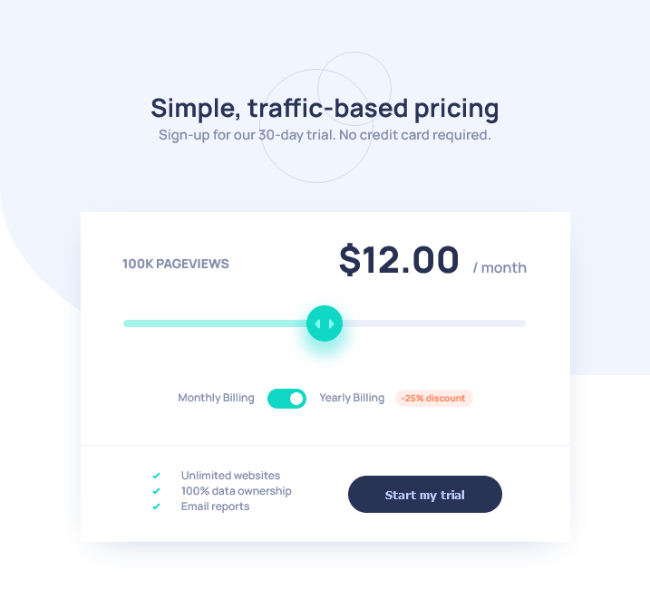

# Frontend Mentor - Interactive pricing component solution

This is a solution to the [Interactive pricing component challenge on Frontend Mentor](https://www.frontendmentor.io/challenges/interactive-pricing-component-t0m8PIyY8). Frontend Mentor challenges help you improve your coding skills by building realistic projects. 

## Table of contents

- [Overview](#overview)
  - [The challenge](#the-challenge)
  - [Screenshot](#screenshot)
  - [Links](#links)
- [My process](#my-process)
  - [Built with](#built-with)
  - [What I learned](#what-i-learned)
  - [Continued development](#continued-development)
  - [Useful resources](#useful-resources)
- [Author](#author)
- [Acknowledgments](#acknowledgments)

**Note: Delete this note and update the table of contents based on what sections you keep.**

## Overview

### The challenge

Users should be able to:

- View the optimal layout for the app depending on their device's screen size
- See hover states for all interactive elements on the page
- Use the slider and toggle to see prices for different page view numbers

### Screenshot

### Links

- Solution URL: [Add solution URL here](https://your-solution-url.com)
- Live Site URL: [https://tielinen.github.io/Frontend-Mentor---Interactive-pricing-component-solution/](https://tielinen.github.io/Frontend-Mentor---Interactive-pricing-component-solution/)

## My process

    1) Plan & Structure: I started with an HTML structure, keeping in mind the modular BEM approach.
    2) Design & Aesthetics: CSS was used to enhance the look, with a focus on responsive and interactive elements.
    3) Interactivity: JavaScript was employed to add dynamic behavior, like adjusting the price according to user input.
    4) Testing & Iteration: Throughout the process, I tested the webpage in the browser, tweaked styles and scripts, and iterated to enhance user experience.

### Built with

- Semantic HTML5 markup
- CSS custom properties
- BEM (Block, Element, Modifier) methodology
- Flexbox
- CSS Grid
## Author

- Website - [Janne Tielinen](https://www.tielinen.pro)
- Frontend Mentor - [@Tielinen](https://www.frontendmentor.io/profile/Tielinen)
- Twitter - [@TielinenJanne](https://www.twitter.com/TielinenJanne)
